# 使用指导

## 归档文件

请使用e2studio导入完整的solution项目。  
此归档文件的开发环境为  
e2studio:Version: 2025-12 (25.12.0)  
fsp:6.4.0  
硬件平台:野火ra6t2电机驱动板  


## MicroPython软件包

添加到任意项目中，需要包含fsp对应的头文件。  
根据以下要求配置项目。(演示的平台为RA6T2)  

#### 项目配置  
排除下列文件的编译:  
ports/renesas-ra/machine_pwm.c  
ports/renesas-ra/machine_uart.c  
ports/renesas-ra/flash.c  
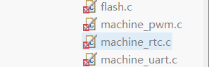  
详细的步骤为：右键对应的文件-资源配置-从构建排除  
  
添加头文件设置:  
直接导入include.xml  
或  
手动添加下列路径  
```
    MicroPython
    MicroPython/ports/renesas-ra 
    MicroPython/lib/tinyusb/hw  
    MicroPython/lib/tinyusb/src  
    MicroPython/shared/tinyusb  
```
具体效果如下:  
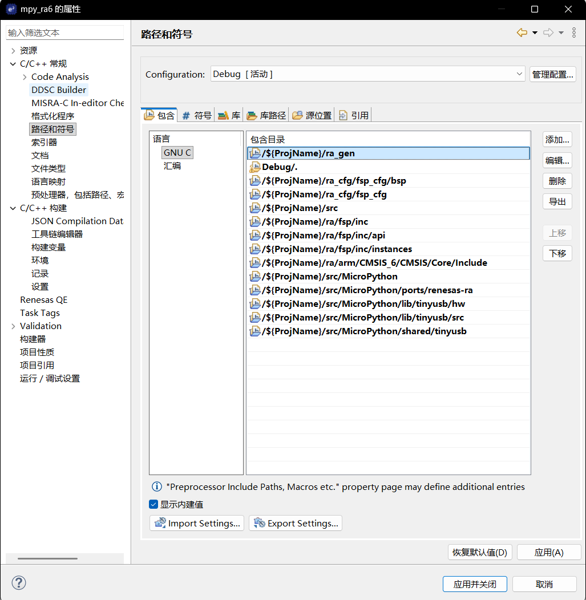  
打开该界面请右键项目-属性:  
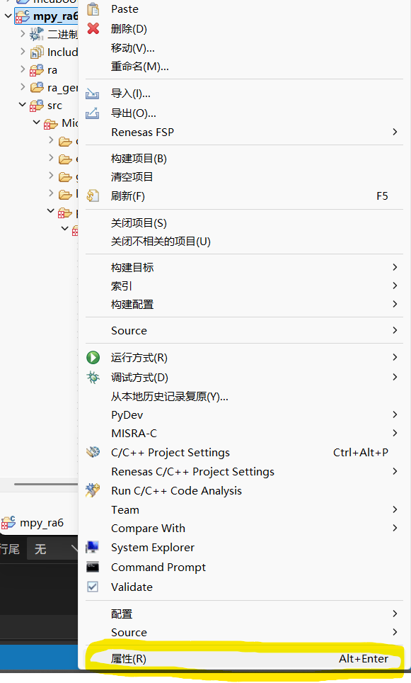  
  
构建设置:
Include files: ports/renesas-ra/mpconfigport.h  
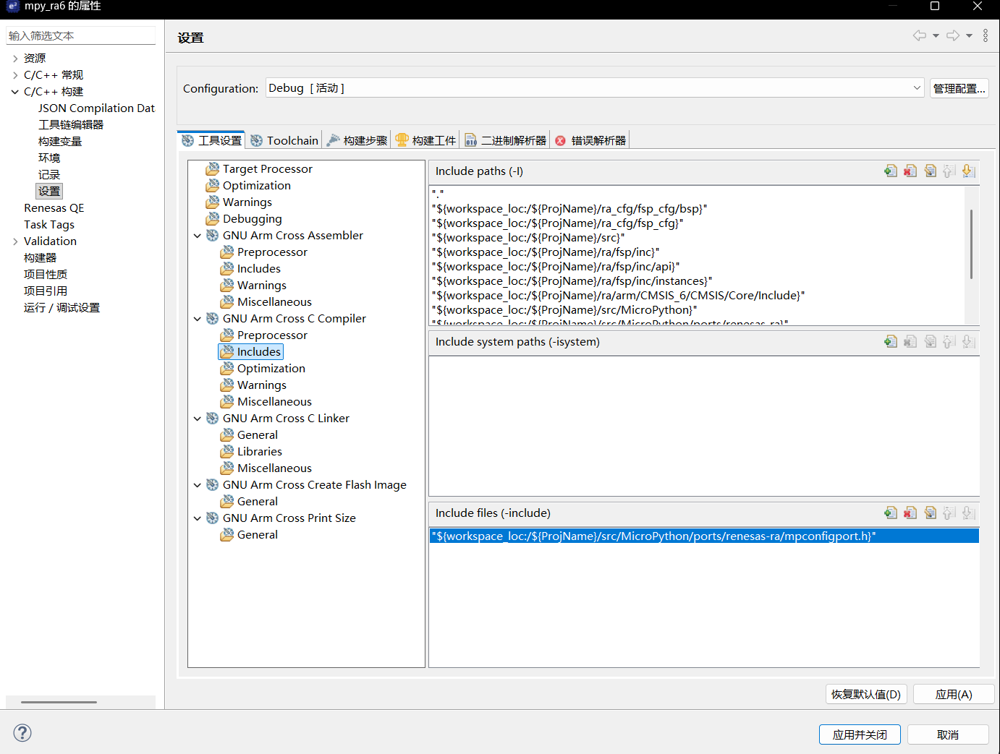

#### 文件修改
ld文件:
在ld文件中添加以下内容  
```ld
__MP_RAM_END = RAM_START + RAM_LENGTH;
_etext      = __flash_readonly$$Limit;
_sidata     = __ram_from_flash$$Load;
_ram_start  = RAM_START;
_sdata      = __ram_from_flash$$Base;
_edata      = __ram_from_flash$$Limit;
_sbss       = __ram_zero$$Base;
_ebss       = __ram_zero$$Limit;
_heap_start = __ram_thread_stack$$Limit;
_heap_end   = __MP_RAM_END;
_sstack     = g_main_stack;
_estack     = g_main_stack + 0x1000;
_ram_end    = __MP_RAM_END;
```  
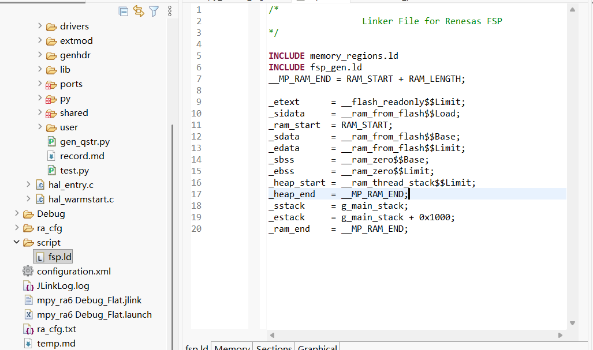  

mpy_board_cfg.h:
根据需求修改该文件。如以下例子，关闭了PWM，于是把RA_PWM_NUM定义为0。根据外设数量定义该值即可。  
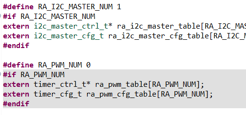
mpy_board_cfg.c:  
根据配置内容在全局数组中添加对应的ctrl。在初始化函数中添加对应的cfg，以下示例为配置I2C。 
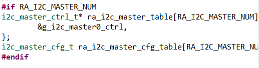
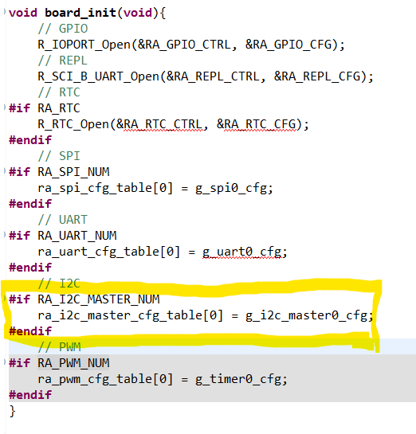  
对于未被启用的模块，需要将drivers里对应的驱动排除编译或删除，对ports里的machine做同样处理。  
ports(machine_rtc.c):  


#### configuration配置
REPL配置，需要按以下去配置对应的Name和Callback，该stack对应的是mpy的控制台，请严格按照该规律命名，此stack是运行的最基本内容。  
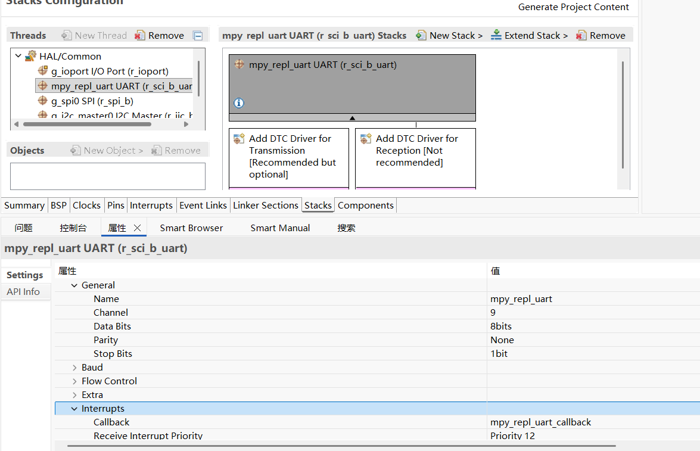  

如果使用到spi，uart，i2c模块，请配置对应的Callback。
```
spi:mpy_spi_callback
uart:mpy_uart_callback
i2c:mpy_i2c_callback
```

#### 入口函数
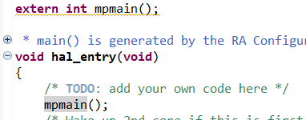  
使用extern声明后调用即可。


## 运行效果
硬件平台为野火的RA6T2电机驱动板，串口控制台启动提示如下：  
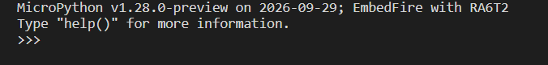